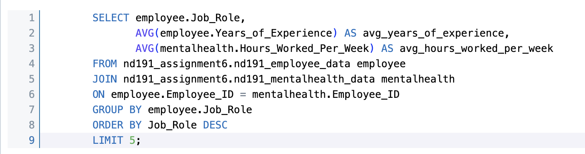
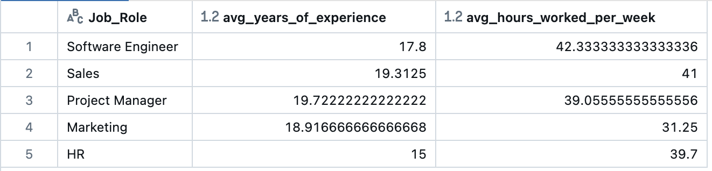

# Nakiyah_Assignment7

## Project: ETL-Query Pipeline with Databricks


## File Structure
```
Nakiyah_Assignment6/
├── .devcontainer/
│   ├── devcontainer.json
│   └── Dockerfile
├── .github/
│   └── workflows/cicd.yml
├── .gitignore
├── Data/
│   ├── EmployeeData.csv
│   ├── MentalHealthData.csv
│   └── Impact_of_Remote_Work_on_Mental_Health.csv
├── mylib/
│   ├── extractData.py
│   ├── loadData.py
│   └── queryData.py
├── SQLQuery.png
├── QueryResults.png
├── main.py
├── test.py
├── setup.py
├── Makefile
├── README.md
├── Requirements.txt
└── complexQueryLog.md

```
## Purpose of this project

### Project Overview
This project implements an ETL (Extract, Transform, Load) pipeline that processes data from external public datasets and stores it in a Databricks SQL database. 
The repository uses environment variables and Databricks credentials (stored in an .env file) for secure connection and execution.

The overall setup of this repository provides a complete end-to-end pipeline for managing data extraction, transformation, 
loading into Databricks, and executing complex queries.


### The key stages of the pipeline are as follows:

- Extract: Data is fetched from a public GitHub repository, split into two DataFrames, cleaned, and saved into CSV files.
- Transform: The CSV files are read into pandas DataFrames, processed, and prepared for insertion into Databricks SQL tables, 
which includes cleaning and transforming the data formats.
- Load: The cleaned and transformed data is loaded into Databricks SQL tables.
- Complex Query Execution: After the data is loaded, the pipeline allows for running SQL queries. 

# Complex Query Explanation



The complex SQL query joins the nd191_employee_data and nd191_mentalhealth_data tables to group data by job role, calculating the average years of experience and average hours worked per week for each role. The results are sorted in descending order by job role, with a limit of five rows returned.
Every time a query is executed, the SQL command and its corresponding Databricks response are logged in a file (complexQueryLog.md). This allows tracking the results and keeping an audit trail.




## Usage
The pipeline can also be run from the command line:

Data extraction: 
```python
python3 main.py extract
```

Data loading: 
```python
python3 main.py load
```

Runing a complex SQL query: 
```python
python3 main.py query 
    """
        SELECT employee.Job_Role, 
               AVG(employee.Years_of_Experience) AS avg_years_of_experience, 
               AVG(mentalhealth.Hours_Worked_Per_Week) AS avg_hours_worked_per_week
        FROM nd191_assignment6.nd191_employee_data employee
        JOIN nd191_assignment6.nd191_mentalhealth_data mentalhealth 
        ON employee.Employee_ID = mentalhealth.Employee_ID
        GROUP BY employee.Job_Role
        ORDER BY Job_Role DESC
        LIMIT 5;
    """
```

Log Ouput:
```
[Row(Job_Role='Software Engineer', avg_years_of_experience=17.8, avg_hours_worked_per_week=42.333333333333336), Row(Job_Role='Sales', avg_years_of_experience=19.3125, avg_hours_worked_per_week=41.0), Row(Job_Role='Project Manager', avg_years_of_experience=19.72222222222222, avg_hours_worked_per_week=39.05555555555556), Row(Job_Role='Marketing', avg_years_of_experience=18.916666666666668, avg_hours_worked_per_week=31.25), Row(Job_Role='HR', avg_years_of_experience=15.0, avg_hours_worked_per_week=39.7)]
```