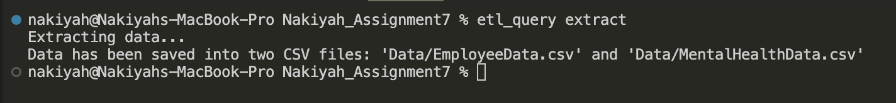
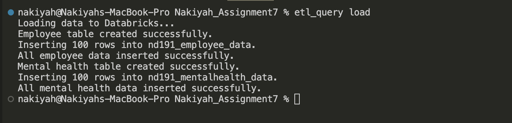
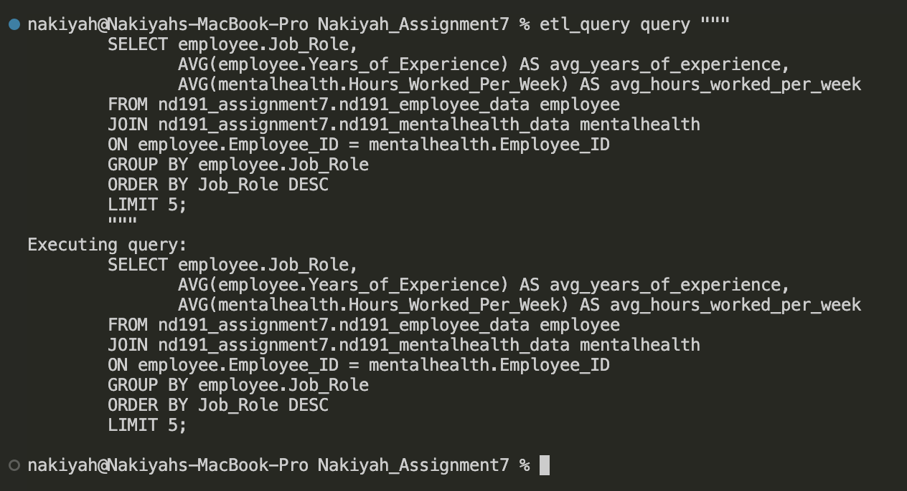

# Nakiyah_Assignment7

## Project: ETL-Query Pipeline with Databricks


## Purpose of this project

### Project Overview
This project provides a command-line interface (CLI) tool for easy interaction with the ETL and query functions. The CLI tool simplifies the ETL workflow, providing users with commands to:
- Extract: Pull data from external sources.
- Transform and Load: Clean and load data into Databricks.
- Query: Run complex SQL queries on the loaded data.

### Requirements
The project requires the following packages:
- databricks-sql-connector: For handling the connection to Databricks SQL.
- pandas: For data manipulation and transformation.
- python-dotenv: For environment variable management.

### Setup
To set up the project and access the cli command tool you would need to run setup.py by typing:
```python
python3 setup.py develop
```

### Usage
To run the ETL process using the CLI, use the command format:

```python
etl_query <command>
```

Supported Commands for this repository
1. To extract data
```python
etl_query extract
```



2. To load data
```python
etl_query load
```



3. To run a SQL Query
```python 
etl_query query """
        SELECT employee.Job_Role, 
               AVG(employee.Years_of_Experience) AS avg_years_of_experience, 
               AVG(mentalhealth.Hours_Worked_Per_Week) AS avg_hours_worked_per_week
        FROM nd191_assignment7.nd191_employee_data employee
        JOIN nd191_assignment7.nd191_mentalhealth_data mentalhealth 
        ON employee.Employee_ID = mentalhealth.Employee_ID
        GROUP BY employee.Job_Role
        ORDER BY Job_Role DESC
        LIMIT 5;
        """
```
Note: you need to type the entire query in the terminal.



